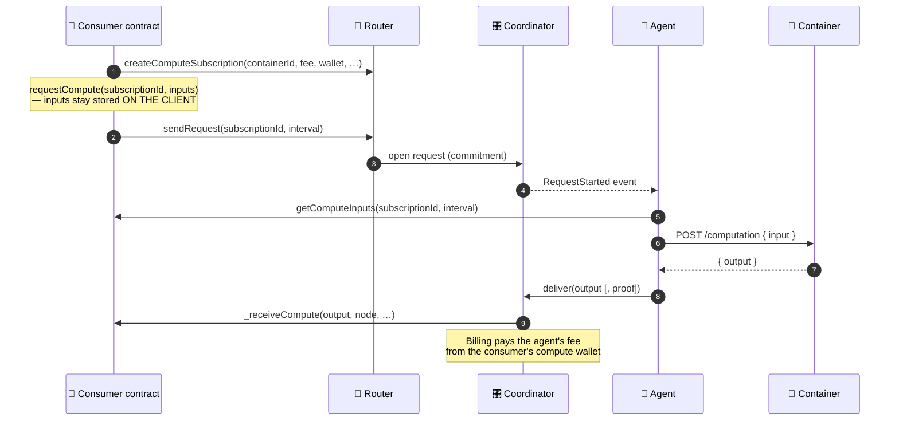
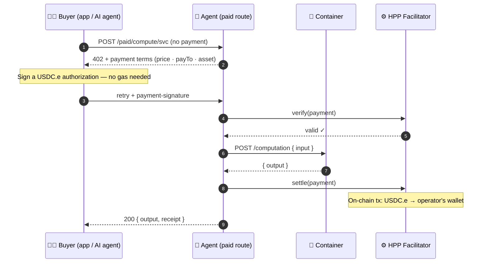

# How it works

Noosphere connects three parties through the chain: **consumers** (contracts that want
computation), **agents** (nodes that run it), and the **protocol contracts** that coordinate
requests, escrow, and delivery between them.

## The roles

- **Consumer.** A smart contract that extends one of the client base contracts and creates a
  **compute subscription**. It funds a **compute wallet** and receives results in a callback.
- **Protocol contracts.**
  - **Router** — the single address consumers talk to. It registers protocol components and
    routes each subscription to the right Coordinator version (`routeId`).
  - **Coordinator** — runs the request lifecycle: opens requests as **commitments**, validates
    agent deliveries, and triggers the consumer callback.
  - **Billing** — meters fees per delivery and settles them from the consumer's compute wallet.
  - **WalletFactory / Wallet** — creates and manages the escrow wallets that fund subscriptions.
- **Agent.** A node running [`noosphere-agent-js`](https://github.com/hpp-io/noosphere-agent-js)
  (built on the [`@noosphere/sdk`](https://github.com/hpp-io/noosphere-sdk) packages). It watches
  chain events, runs the requested **container**, and submits the delivery transaction.
- **Containers.** Ordinary Docker images exposing one endpoint —
  [`POST /computation`](./container-contract.md). Subscriptions reference containers by ID from
  the [community registry](./registry-and-deployments.md), so *any* agent running that container
  can serve the request.

## The request lifecycle

1. **Subscribe.** The consumer creates a subscription: which container to run, the fee per
   delivery (`feeToken` + `feeAmount`), which compute wallet funds it, and optionally a
   **verifier**.
2. **Request.** The client stores the inputs and calls `sendRequest` (or the interval schedule
   opens one). The Coordinator records a **commitment** — the on-chain fingerprint of what was
   asked, for which fee, in which interval — and emits `RequestStarted`. Inputs never travel
   through the Router: agents fetch them from the client (`getComputeInputs`), which is what
   keeps large inputs cheap.
3. **Execute.** Agents see the request, fetch the inputs, run the container, and submit the
   output on-chain (the delivery transaction is the agent's gas cost).
4. **Deliver & settle.** The Coordinator validates the delivery against the commitment, invokes
   the consumer's callback, and Billing pays the agent from the compute wallet. With
   `useDeliveryInbox`, results are stored in a **DeliveryInbox** for the consumer to pull instead.

## For comparison: the x402 per-call flow (separate rail)

The same agent can also sell per-call over plain HTTP with [x402](/x402) — worth seeing side
by side, because **none of the protocol contracts above appear in it**. No subscription, no
Router/Coordinator, no compute wallet: the buyer pays per request and the
[HPP facilitator](/x402/facilitator) settles straight to the operator's wallet.

| | On-chain rail (above) | x402 rail |
| --- | --- | --- |
| Who asks | Smart contract, via subscription | Anyone, via HTTP/MCP |
| Protocol contracts involved | Router · Coordinator · Billing · compute wallet | **None** |
| Payment | Escrowed fee per delivery | Signed stablecoin authorization per call |
| Result returns | On-chain callback / DeliveryInbox | The HTTP response itself |

Configuration and selling guide: [Sell from an agent](/x402/sell-from-an-agent).

## Transient vs scheduled subscriptions

| | Transient | Scheduled |
| --- | --- | --- |
| Shape | One-shot: create → request → one delivery | Recurring: every `intervalSeconds`, up to `maxExecutions` |
| Inputs | Stored on-chain per request | Produced by the consumer per interval |
| Typical use | "Ask the model, act on the answer" | Price feeds, periodic scoring, batch jobs |
| Base contract | `TransientComputeClient` | `ScheduledComputeClient` |

Subscriptions activate lazily and can be cancelled by their owner at any time.

## Payment: compute wallets and billing

Consumers pre-fund a **compute wallet** (created via the WalletFactory) and point their
subscriptions at it. On every valid delivery, **Billing** transfers the subscription's
`feeAmount` in `feeToken` from that wallet to the delivering agent — one delivery per request,
first valid delivery wins. (The delivering agent must also have its own factory-created
payment wallet to receive the fee.)

Budget rule of thumb: `feeAmount × executions`, plus any protocol fee.

## Verification: trust is a dial

- **Baseline** — accept the delivering agent's answer as-is (no verifier): cheapest and fastest.
- **Verifier contracts** — a subscription can name an on-chain verifier (the `IVerifier`
  interface). Deliveries then carry a proof and only count once the verifier accepts it.
  Available verifiers are listed per network in the
  [community registry](./registry-and-deployments.md).

## NoosphereVRF

The same agent network serves **NoosphereVRF** — epoch-based verifiable randomness that
contracts can consume on both networks (addresses in
[Registry & deployments](./registry-and-deployments.md)). Agent operators opt in by running the
registry's `noosphere-vrng` container and enabling the `vrf` config block. Try it live: the
[Playground](https://dapptest.hpp.io/)'s **Raffle** and **Dice** draw with NoosphereVRF.
