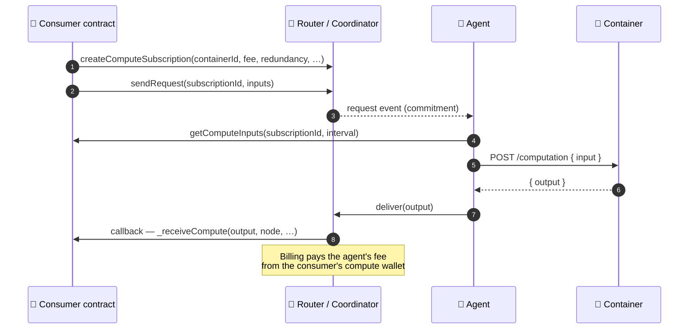

# How it works

Noosphere connects three parties: **consumers** who want computation, **agents** who run it, and
the **protocol contracts** that coordinate requests, payments, and verification between them.

## The roles

- **Consumer.** A smart contract that needs off-chain work. It extends one of the client base
  contracts ([`TransientComputeClient`](./request-onchain-compute.mdx) for one-shot requests,
  `ScheduledComputeClient` for recurring ones), creates a **compute subscription**, and receives
  results through a callback.
- **Protocol contracts.** The **Router** is the single entry point consumers talk to — it creates
  subscriptions and emits requests. The **Coordinator** manages the agent side: request
  commitments, result delivery, and hand-off to **Billing**, which meters fees and pays agents
  through per-consumer **compute wallets** (created by the Wallet Factory).
- **Agent.** A node running [`noosphere-agent-js`](https://github.com/hpp-io/noosphere-agent-js).
  It watches the chain for requests it can serve, runs the matching **container**, and delivers
  the output back on-chain. The same node can also [sell compute per-call over x402](./sell-compute.mdx).
- **Containers.** Ordinary Docker images that expose one endpoint —
  [`POST /computation`](./container-contract.md). The protocol identifies them by container ID, so
  a subscription says *what* to run, and any agent that runs that container can serve it.

## The request lifecycle

1. The consumer creates a **subscription**: which container to run, what fee it pays per
   delivery (`feeToken` + `feeAmount`), how many independent agents should answer
   (`redundancy`), which wallet funds it, and optionally which **verifier** must check results.
2. `sendRequest` (or the interval schedule) opens a request. Agents see it, **commit**, run the
   container, and **deliver** the output.
3. The Coordinator invokes the consumer's callback with the output and pays the agent from the
   consumer's compute wallet.

## Transient vs scheduled subscriptions

| | Transient | Scheduled |
| --- | --- | --- |
| Shape | One-shot: create → request → one delivery | Recurring: every `intervalSeconds`, up to `maxExecutions` |
| Inputs | Stored on-chain per request (`_requestCompute(subscriptionId, inputs)`) | Produced by the consumer per interval |
| Typical use | "Ask the model a question, act on the answer" | Price feeds, periodic risk scoring, batch jobs |
| Base contract | `TransientComputeClient` | `ScheduledComputeClient` |

Subscriptions activate lazily and can be cancelled by their owner. With `useDeliveryInbox`,
results land in a **DeliveryInbox** instead of a direct callback — useful when the consumer wants
to pull results on its own schedule.

## Payment and billing

Consumers fund a **compute wallet** (created via the protocol's Wallet Factory) and approve it
for their subscriptions. Each delivery, **Billing** transfers the subscription's `feeAmount` in
`feeToken` to the delivering agent (plus protocol fees, if configured). Redundancy `N` means `N`
agents each deliver and each get paid — you're buying independent answers.

> This is the **on-chain rail's** billing. The **x402 rail** is separate and simpler: the buyer
> pays USDC.e per HTTP call and the [HPP facilitator](/x402/facilitator) settles it directly to
> the seller's wallet — no compute wallet, no gas for the seller. See
> [Sell compute with x402](./sell-compute.mdx).

## Verification

Trust is a dial, not a switch:

- **Redundancy** — ask several agents for the same work and compare answers.
- **Verifier contracts** — a subscription can name an on-chain verifier
  implementing `IVerifier`; agents attach proofs (optionally produced by a companion *proof
  service* container) and deliveries only count once verified.
- **Execution receipts (x402 rail)** — per-call sales can embed a signed receipt binding the
  price, the settlement transaction, and hashes of the exact request and response. See
  [Sell compute](./sell-compute.mdx#execution-receipts).

## NoosphereVRF

Agents can additionally serve **NoosphereVRF** — epoch-based verifiable randomness that contracts
can consume. Operators opt in with the [`vrf` config block](./configuration.md); consumers use the
VRF contracts deployed alongside the core protocol.

## Where things live

| Piece | Repository |
| --- | --- |
| Protocol contracts (Router, Coordinator, Billing, clients, VRF) | [`hpp-io/noosphere-evm`](https://github.com/hpp-io/noosphere-evm) |
| Agent node (worker + x402 seller + dashboard) | [`hpp-io/noosphere-agent-js`](https://github.com/hpp-io/noosphere-agent-js) |
| Payment rail, facilitator, explorer | [x402 on HPP](/x402) · [x402 Explorer](https://x402-explorer.hpp.io) |
