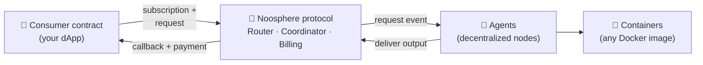

# Noosphere

Smart contracts can't run an AI model, crunch a dataset, or react to complex off-chain
conditions. **Noosphere** fixes that: it's HPP's on-chain framework for **requesting off-chain
compute from smart contracts** — and getting the result back on-chain, with payment and
verification handled by the protocol.

The defining property: **both the request and the settlement live on-chain.** A consumer
contract creates a *compute subscription*; decentralized **agents** pick the work up, run it in
ordinary Docker containers, and deliver the output back through the protocol, which pays them
from the consumer's escrow wallet — all in the same on-chain lifecycle.

## What you can build

- **AI-powered dApps** — ask an LLM or a model a question from a contract and act on the answer
  on-chain: risk scoring, valuations, predictions, content generation.
- **Recurring pipelines** — scheduled subscriptions run the same computation every interval:
  price feeds, portfolio rebalancing signals, periodic risk checks.
- **Verifiable randomness** — consume **NoosphereVRF**, served by the same agent network.

## One agent, two markets

The same agent node — and the same containers — can earn from **two independent markets**.
This documentation covers the on-chain protocol; per-call selling is a separate product with
its own docs ([x402 on HPP](/x402)).

| | ⛓ Compute network (this docs) | 💰 x402 per-call selling |
| --- | --- | --- |
| Who buys | **Smart contracts** (subscriptions) | Apps, scripts, AI agents — plain HTTP/MCP |
| Request path | **On-chain** — Router/Coordinator route it, results return by callback | Off-chain — a normal paid HTTP call; no protocol contracts involved |
| Settlement | **On-chain billing** from the consumer's escrow wallet, per delivery | Stablecoin payment per call, settled by the [HPP facilitator](/x402/facilitator) straight to your wallet |
| Funds to start | Agent wallet needs ETH (delivery gas) | **None** — an empty wallet works, gas is sponsored |
| Verification | On-chain verifier contracts | Optional signed execution receipt |
| Docs | You are here | **[Sell from an agent](/x402/sell-from-an-agent)** |

## The pieces

| Piece | What it is | Repository |
| --- | --- | --- |
| **Protocol contracts** | Router (entry point), Coordinator (request lifecycle), Billing + compute wallets (escrow & fees), client base contracts | [`noosphere-evm`](https://github.com/hpp-io/noosphere-evm) |
| **Agent node** | Runs containers, watches the chain, delivers results | [`noosphere-agent-js`](https://github.com/hpp-io/noosphere-agent-js) |
| **SDK** | `@noosphere/*` npm packages the agent is built from (contracts, crypto, payload, registry) | [`noosphere-sdk`](https://github.com/hpp-io/noosphere-sdk) |
| **Registry** | Community catalog of containers, verifiers, and the deployed contract addresses per network | [`noosphere-registry`](https://github.com/hpp-io/noosphere-registry) |

Noosphere is live on **HPP Mainnet** and **HPP Sepolia** — contract addresses in
[Registry & deployments](./registry-and-deployments.md).

## Try it in your browser first

No setup at all: the **[Noosphere Playground](https://dapptest.hpp.io/)** (HPP Sepolia) lets
you drive the protocol from a wallet-connected dApp — create a compute subscription and chat
with an **on-chain LLM**, or draw provably-fair winners with **NoosphereVRF** (Raffle & Dice).

## Choose your path

| I want to… | Start here |
| --- | --- |
| **feel it, zero setup** (browser dApp) | **[Noosphere Playground ↗](https://dapptest.hpp.io/)** |
| **see it work end to end** (15 min, Sepolia) | **[Tutorial: hello-world](./first-request.mdx)** |
| understand the protocol | **[How it works](./how-it-works.md)** |
| call compute **from my contract** | **[Request compute on-chain](./request-onchain-compute.mdx)** |
| **run an agent** and earn fees | **[Set up the node](./node-setup.mdx)** → [serve the network](./serve-compute-network.mdx) |
| sell my model **per-call** (x402, no funds needed) | **[Sell from an agent](/x402/sell-from-an-agent)** |
| package my model as a container | **[Container contract](./container-contract.md)** |
