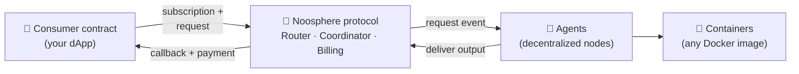

# Noosphere

Smart contracts can't run an AI model, crunch a dataset, or react to complex off-chain
conditions. **Noosphere** fixes that: it's HPP's on-chain framework for **requesting off-chain
compute from smart contracts** — and getting the result back on-chain, with payment, redundancy,
and verification handled by the protocol.

The defining property: **both the request and the settlement live on-chain.** A consumer
contract creates a *compute subscription*; decentralized **agents** pick the work up, run it in
ordinary Docker containers, and deliver the output back through the protocol, which pays them
from the consumer's escrow wallet — all in the same on-chain lifecycle.

## What you can build

- **AI-powered dApps** — ask an LLM or a model a question from a contract and act on the answer
  on-chain: risk scoring, valuations, predictions, content generation.
- **Recurring pipelines** — scheduled subscriptions run the same computation every interval:
  price feeds, portfolio rebalancing signals, periodic risk checks.
- **Verifiable randomness** — consume **NoosphereVRF**, served by the same agent network.

## The pieces

| Piece | What it is | Repository |
| --- | --- | --- |
| **Protocol contracts** | Router (entry point), Coordinator (request lifecycle), Billing + compute wallets (escrow & fees), client base contracts | [`noosphere-evm`](https://github.com/hpp-io/noosphere-evm) |
| **Agent node** | Runs containers, watches the chain, delivers results | [`noosphere-agent-js`](https://github.com/hpp-io/noosphere-agent-js) |
| **SDK** | `@noosphere/*` npm packages the agent is built from (contracts, crypto, payload, registry) | [`noosphere-sdk`](https://github.com/hpp-io/noosphere-sdk) |
| **Registry** | Community catalog of containers, verifiers, and the deployed contract addresses per network | [`noosphere-registry`](https://github.com/hpp-io/noosphere-registry) |
| **Starter app** | Scaffold-style dApp kit with Noosphere examples | [`noosphere-starter-app`](https://github.com/hpp-io/noosphere-starter-app) |

Noosphere is live on **HPP Mainnet** and **HPP Sepolia** — contract addresses in
[Registry & deployments](./registry-and-deployments.md).

## Choose your path

| I want to… | Start here |
| --- | --- |
| understand the protocol | **[How it works](./how-it-works.md)** |
| call compute **from my contract** | **[Request compute on-chain](./request-onchain-compute.mdx)** |
| **run an agent** and earn fees | **[Run an agent](./run-an-agent.mdx)** |
| package my model as a container | **[Container contract](./container-contract.md)** |

:::info Selling compute without the chain?
Noosphere agents can *also* sell the same containers per-call over plain HTTP, paid with
stablecoins via the **x402** protocol — no subscriptions, no on-chain requests. That is a
separate product with its own docs: **[Sell from an agent](/x402/sell-from-an-agent)**.
:::
