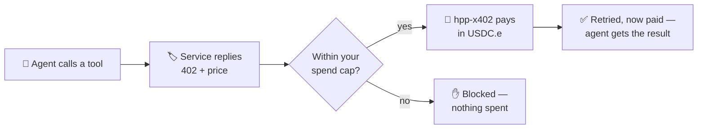

import Tabs from '@theme/Tabs';
import TabItem from '@theme/TabItem';

# Pay from an AI agent

Agentic payments are **keyless, wallet-less, and autonomous**: an AI agent discovers a price, pays
it, and gets the result — no dashboard signup, no human clicking "confirm," no private key pasted
into a prompt. x402 makes this possible because the price and the payment are just an HTTP `402`
response and a signed message.

On HPP, the tool that gives your agent this ability is **`hpp-x402`** — a command-line tool plus an
**MCP bridge** (`@hpp-io/x402-mcp-bridge`). You fund a wallet and set a spend cap; the bridge adds
payment tools to your agent host so the agent can find and pay for services on its own — always
within your cap, always in USDC.e, always non-custodial.

:::tip Which path is this?
Building a client or server **in code**? Use the [`@x402` SDK](./quickstart-buyers.mdx) directly.
Want an **existing AI agent** (Claude, Cursor, …) to pay autonomously — or to pay from your
terminal? That's this guide. Both settle through the same [HPP facilitators](./facilitator.mdx).
:::

## How it works

When your agent calls a tool that costs money, the bridge handles the whole payment for it:



Three things stay true the whole time:

- **Pay-per-call** — the agent is charged the exact price of each request, nothing standing.
- **Capped** — it can never spend more than you funded (light mode) or your on-chain daily allowance
  (Safe mode).
- **Keyless & non-custodial** — the agent never sees your private key; funds move straight from your
  wallet to the seller. The facilitator only verifies and settles.

Supported hosts: **Claude Desktop, Claude Code, Cursor, Windsurf, OpenClaw** — any host that speaks
the [Model Context Protocol](https://modelcontextprotocol.io).

## Requirements

- **Node.js 20+** (`node -v`). Install from [nodejs.org](https://nodejs.org), `brew install node`,
  or [nvm](https://github.com/nvm-sh/nvm).
- **An OS keychain** to store the wallet key — macOS Keychain, Linux gnome-keyring, or Windows
  Credential Manager. On a headless server without one, see [Headless & CI](#headless--ci).
- **A little USDC.e** on the network you'll use (HPP Sepolia to try it, HPP Mainnet for real value).
  See [Networks & Token](./networks-and-token.mdx).

## 1. Install

```bash
npm install -g @hpp-io/x402-mcp-bridge
# …or the one-line installer (checks Node, then npm i -g):
# curl -fsSL https://raw.githubusercontent.com/hpp-io/x402-tools/main/install/install.sh | bash
# Windows (PowerShell):
# irm https://raw.githubusercontent.com/hpp-io/x402-tools/main/install/install.ps1 | iex
```

This puts two commands on your PATH:

- **`hpp-x402`** — the CLI you run.
- **`x402-mcp-bridge`** — the stdio MCP server your agent host launches (you don't run this directly).

## 2. Create a wallet and wire your host

One command creates a wallet in your OS keychain and registers the bridge into your agent host:

<Tabs groupId="host">
<TabItem value="claude-code" label="Claude Code" default>

```bash
hpp-x402 setup --install claude-code
```

Runs `claude mcp add hpp-x402 …` for you. If the `claude` CLI isn't installed, the command prints the
exact `claude mcp add` line to run once it is.

</TabItem>
<TabItem value="claude" label="Claude Desktop">

```bash
hpp-x402 setup --install claude
```

Writes the `hpp-x402` server into `claude_desktop_config.json`.

</TabItem>
<TabItem value="cursor" label="Cursor">

```bash
hpp-x402 setup --install cursor
```

Writes `~/.cursor/mcp.json`.

</TabItem>
<TabItem value="windsurf" label="Windsurf">

```bash
hpp-x402 setup --install windsurf
```

</TabItem>
<TabItem value="openclaw" label="OpenClaw">

```bash
hpp-x402 setup --install openclaw
```

</TabItem>
</Tabs>

You'll see something like:

```text
network : HPP Sepolia (eip155:181228)
wallet  : 0x1717aa…BdEf (generated)
storage : keychain (keychain://hpp-x402/delegate-default)

▶ Fund: send USDC.e to 0x1717aa…BdEf on HPP Sepolia — no native gas needed.
✓ registered with Claude Code (claude mcp add)
```

You're now in **light mode** — the amount you fund is your spend cap, so start small.

:::note What `setup` does
Generates a delegate key, stores it in the OS keychain as `keychain://hpp-x402/<account>` (never
plaintext on disk), and writes the MCP server config for your host. Re-run any time; it's idempotent.
Prefer to target the host later? Run `hpp-x402 install <host>` on its own.
:::

## 3. Fund the wallet

```bash
hpp-x402 fund
```

```text
Send USDC.e to 0x1717aa…BdEf on HPP Sepolia — no native gas needed (gasless settlement).
0.00 USDC.e
```

Send **USDC.e** to that address on the network you're using — HPP Sepolia (`eip155:181228`, the
default) or HPP Mainnet (`eip155:190415`). Confirm it arrived with `hpp-x402 wallet balance`.

## 4. Let your agent pay

**Restart your agent host** so it picks up the bridge, then talk to your agent. First, prove the
wallet is connected:

> **“What's my hpp-x402 wallet address and balance?”**

The agent answers using the wallet tool. Now let it transact:

> **“Discover x402 services on HPP and call one.”**

Behind the scenes the bridge gives the agent these tools:

| Tool | What the agent does with it |
| --- | --- |
| `wallet_address` | report your wallet address (so you can fund it) |
| `hpp_discover` | browse/search the curated [service directory](./directory.mdx) |
| `hpp_call` | pay + invoke a discovered service, within your cap |
| `x402_http_call` | pay any x402 URL directly (e.g. a link you were handed) |

The agent finds a service, pays it in USDC.e, and returns the result — all inside your spend cap.

## Pay from the terminal

You can do exactly what the agent does, by hand:

```bash
hpp-x402 discover --limit 5
```

```text
c928e2c2-678a-4a80-8db1-42a2a9ce96d0
  http  upto  price=0  (eip155:181228)
  Minimal compute container for smoke tests
  http://localhost:4021/paid/compute/hello-world

1 service(s). Pay one:  hpp-x402 call <url or id> --body '{…}'
```

Each result shows `type · scheme · price · network · description · URL · id`. Then pay + call it —
by the id from `discover`, **or** by a URL you already have:

```bash
hpp-x402 call <url-or-id> --body '{"prompt":"a red bicycle"}'
```

```text
{"status":200,"ok":true,"body":{ …the service's response… }}
```

`call` picks the payment [scheme](./how-it-works.md) automatically. Filter or force a scheme when you
need to:

```bash
hpp-x402 discover --scheme upto          # list only usage-based services
hpp-x402 call <url> --scheme exact       # force a scheme if a seller offers both
```

## Wallet modes

<Tabs>
<TabItem value="light" label="Light (default)" default>

The delegate key **is** the wallet and holds USDC.e directly. Whatever you fund is the hard ceiling —
the agent can't overspend it. Best for quick starts and per-agent budgets.

```bash
hpp-x402 fund      # fund it with only what you're willing to spend
```

</TabItem>
<TabItem value="safe" label="Safe (governance)">

Keep funds in a [Safe](https://safe.global) and grant the delegate an **on-chain daily allowance**
via an AllowanceModule — a hard, revocable cap over a shared treasury, for teams.

```bash
hpp-x402 safe setup --owner-pk 0x... --allowance 5    # daily cap in USDC.e (deploy + enable + delegate)
hpp-x402 safe revoke --owner-pk 0x... --delegate 0x... # emergency stop
```

Then set `SAFE_ADDRESS` + `ALLOWANCE_MODULE_ADDRESS` in the host config; the bridge auto-tops up the
delegate from the Safe within the on-chain cap before each payment.

</TabItem>
</Tabs>

## Spending controls

Beyond the wallet cap, set **per-host guardrails** — max per call, cooldowns, allow/deny:

```bash
hpp-x402 policy show                                        # current policy
hpp-x402 policy set api.example.com --max-per-call 5 --cooldown-ms 300000
```

Every paid call is checked against this policy before any funds move.

## Sell from the CLI

Turn any endpoint into a paid x402 service in one command — the CLI mirror of the
[Sellers quickstart](./quickstart-sellers.mdx):

```bash
hpp-x402 serve --pay-to 0xYou --price 10000                        # exact (fixed price)
hpp-x402 serve --pay-to 0xYou --price 10000 --handler https://my-api/run   # forward to your API
hpp-x402 serve --pay-to 0xYou --price 10000 --scheme upto          # usage-based, gasless
```

It returns `402` until paid, then runs your handler (echo by default, or forward the body to
`--handler`). `--price` is in atomic USDC.e (6 decimals → `10000` = 0.01). By default it advertises
itself, so after the **first paid call** it's indexed into the [directory](./directory.mdx) and other
agents can discover it. Behind a tunnel? Pass `--url https://your-public-host` so the public address
is what gets listed.

## Headless & CI

A server with no OS keychain can't store a key. Use a raw key instead:

```bash
hpp-x402 setup --print-key            # prints a raw key instead of using the keychain
# or export DELEGATE_PRIVATE_KEY=0x... and skip key generation
```

Read-only commands (`discover`, `status`, `--help`) work anywhere. To try the CLI without touching
the host at all, run it in Docker:

```bash
docker run --rm node:20 bash -c \
  'npm i -g @hpp-io/x402-mcp-bridge && hpp-x402 discover --limit 5 && hpp-x402 setup --print-key'
```

## Command reference

| Command | What it does |
| --- | --- |
| `setup` | Onboard: create a wallet, print funding info, optionally `--install <host>` |
| `wallet <address\|balance\|generate\|import\|remove>` | Manage the keychain wallet |
| `install <host>` | Register the bridge into claude / claude-code / cursor / windsurf / openclaw |
| `fund` · `status` | Funding address · config + balance + reachability |
| `discover [query]` | Browse the directory (`--scheme exact\|upto` to filter) |
| `call <url-or-id>` | Pay + call a service (exact or upto, auto) |
| `serve` | Run a paid x402 endpoint (`--scheme exact\|upto`) |
| `policy` · `channel` · `safe` | Spend policy · batch channels · governance wallet |

Common options: `-a, --account <name>` (keychain wallet, default `delegate-default`) and
`-n, --network <id>` (default `eip155:181228`). Run `hpp-x402 <command> --help` for the full flags.

## Troubleshooting

| Symptom | Fix |
| --- | --- |
| Agent doesn't see the x402 tools | Restart the host; re-run `hpp-x402 install <host>`; check the config path it printed. |
| `Couldn't access platform storage` | No OS keychain — use `setup --print-key` or `DELEGATE_PRIVATE_KEY` ([Headless](#headless--ci)). |
| Funded, but balance shows 0 | Wrong network. Confirm with `hpp-x402 status` and fund the one you're using. |
| `install claude-code`: "claude not found" | Install Claude Code, then run the printed `claude mcp add …`, or target a file-based host. |
| Payment blocked | Over your per-host cap — review with `hpp-x402 policy show`. |

## Full manual

The complete command reference, every flag, and advanced setups are in the
**[hpp-x402 manual](https://github.com/hpp-io/x402-tools)** (`@hpp-io/x402-mcp-bridge`).
