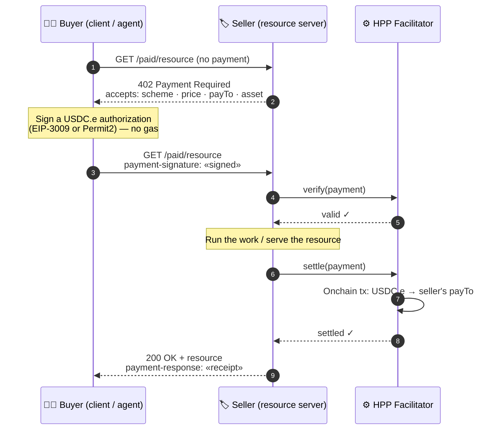

# How it works

x402 turns a normal HTTP request into a paid one using the `402 Payment Required` status code.
Nothing about the transport changes — a paid endpoint is still a regular URL that returns `402`
until a valid payment is attached.

## The three roles

- **Resource server (the seller).** An HTTP service that puts a price on one or more routes.
  When an unpaid request arrives, it replies with `402` and a list of acceptable payment terms
  (`accepts`). When a paid request arrives, it verifies and settles the payment, then returns the resource.
- **Client (the buyer).** A browser, a backend, or an AI agent that wants the resource. It reads the
  `402`, signs a stablecoin authorization for one of the offered terms, and retries with a `payment-signature` header.
- **Facilitator.** A service that the resource server delegates two jobs to: **verify** a payment
  signature, and **settle** it onchain. HPP operates the facilitators so sellers never run an RPC node
  or hold a settlement key. See [Facilitator](./facilitator.mdx).

## The payment flow



The **buyer** never touches the facilitator directly — it just signs and retries. The **seller**
delegates verify + settle to the **facilitator**, so it never runs a node or holds a settlement key.

HPP's resource-server middleware uses **serve-then-settle**: it verifies the payment first, serves the
response, and settles after a successful result (`status < 400`). The buyer gets a settlement receipt
back in the `payment-response` header.

Settlement is **synchronous with the response** — the seller's reply is held until the facilitator
settles, then sent. So a `200` (carrying a `payment-response` receipt) means the payment **settled
onchain**; if settlement fails, the buyer receives an error instead of the resource. Because the seller
does the work *before* settling, a failed settlement means the work was performed but not delivered or
charged. On HPP the facilitator waits for onchain confirmation before returning, so a paid call
includes the settlement time (settle p50 ~1.3s).

## The 402 challenge

The body of the `402` response (x402 version 2) tells the buyer exactly how it may pay. Each entry in
`accepts` is one acceptable `(scheme, network)` with its price and asset:

```json
{
  "x402Version": 2,
  "resource": {
    "url": "https://seller.example.com/paid/hello",
    "description": "A paid hello-world endpoint."
  },
  "accepts": [
    {
      "scheme": "exact",
      "network": "eip155:190415",
      "amount": "10000",
      "asset": "0x401eCb1D350407f13ba348573E5630B83638E30D",
      "payTo": "0xYourReceivingAddress",
      "maxTimeoutSeconds": 600,
      "extra": { "name": "Bridged USDC", "version": "2" }
    }
  ],
  "extensions": {}
}
```

- `amount` is in the asset's base units — `"10000"` is `0.01` USDC.e (6 decimals).
- `extra` carries the EIP-712 domain the buyer needs to sign (`exact`), and scheme-specific data such
  as the `facilitatorAddress` for gas-sponsored `upto`.
- A multi-network or multi-scheme seller returns several `accepts`; the buyer's SDK selects one (next
  section). The settlement receipt comes back base64-encoded in the `payment-response` header and
  decodes to `{ success, transaction, network, payer, amount? }`.

## Payment schemes

A *scheme* defines how the buyer authorizes payment and how the facilitator settles it onchain. The
seller lists one or more schemes per route, in priority order; the buyer's SDK picks the first one it supports.
HPP supports two upstream-standard schemes:

### `exact`

Pay an **exact** amount using [EIP-3009](https://eips.ethereum.org/EIPS/eip-3009)
(`transferWithAuthorization`). The buyer only signs a transfer for the precise price; the facilitator
submits it onchain and pays the gas, so the buyer needs no ETH. Simple and final — best when the price
is known up front.

### `upto`

Authorize **up to** a maximum using [Permit2](https://github.com/Uniswap/permit2), and settle the
actual amount consumed (which may be less than the cap). This fits metered or usage-based pricing
where the final cost isn't known until the work runs.

Like `exact`, the settlement itself is relayed by the facilitator. The one extra cost is `upto`'s
**one-time Permit2 approval** — and on HPP that approval is sponsored via
[EIP-2612](https://eips.ethereum.org/EIPS/eip-2612) **when the seller enables it**, so a paying agent
needs **zero native ETH**, only USDC.e. See
[Facilitator → Gasless settlement](./facilitator.mdx#gasless-settlement-upto).

> Both schemes are part of the standard x402 specification. A facilitator advertises exactly which
> `(network, scheme)` pairs it supports at its `/supported` endpoint, and the seller's accepts must be
> a subset of that.

Each payment authorization is **single-use**: it carries a unique nonce and a validity window, so a
captured `payment-signature` header cannot be replayed for a second charge, and the buyer signs a
fresh authorization for every request.

## Next

- [Networks & Token](./networks-and-token.mdx) — the chains and the USDC.e asset.
- [Quickstart: Sellers](./quickstart-sellers.mdx) / [Buyers](./quickstart-buyers.mdx) — working code.
